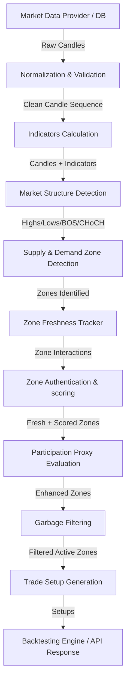

# Architecture Documentation

This document describes the high-level system architecture of the **Stock Analysis Backend**, which serves as a deterministic research and analysis engine for Indian stocks.

## Design Philosophy

1. **Deterministic Core**: The analysis engine is strictly rule-based, mathematical, and deterministic. It evaluates market structure and Supply & Demand zones using quantitative criteria.
2. **AI as an Explanatory Layer**: Generative AI (via local Ollama) is strictly decoupled from the core logic. It acts solely as a natural-language interpreter of the deterministic outputs. The core engine functions independently if AI is unavailable.
3. **Layered Decoupling**: Components are designed as unidirectional pipeline steps. No circular references are allowed, and modules can be independently tested without database or API frameworks.
4. **No Execution/Broker Connectivity**: The backend strictly facilitates research and historical backtesting. It does not place trades or connect to live brokers.

---

## High-Level Pipeline

The processing pipeline is strictly sequential. Data flows from the source database or market provider through validation, indicators, structural analysis, zone processing, and finally setup generation:

---

## Core Components and Responsibilities

### 1. Data Subsystem (`app/data/`)
- **Providers**: Interfaces with data providers (e.g., Yahoo Finance, local CSVs, or other free APIs) via the `MarketDataProvider` abstraction.
- **Normalization**: Maps raw inputs to standard timeframe intervals (5m, 15m, 30m, 1h, 4h, Daily, Weekly) and OHLCV shapes.
- **Validation**: Enforces integrity constraints (non-negative values, logic rules like `High >= Low`, missing candle detection, timezone alignment) and emits a **Data Quality Report**.

### 2. Analysis Subsystem (`app/analysis/`)
- **Indicators**: Configurable computations (EMA, SMA, ATR, RSI, VWAP, Relative Volume) avoiding look-ahead bias.
- **Structure**: Mathematical tracking of swing highs/lows, Breaks of Structure (BOS), and Change of Character (CHoCH) to establish market bias (BULLISH, BEARISH, SIDEWAYS).
- **Zones**: Detects DBR (Drop-Base-Rally), RBR (Rally-Base-Rally), RBD (Rally-Base-Drop), and DBD (Drop-Base-Drop) price structures.
- **Freshness & Authentication**: Maps how historical price touches zones, determining states (FRESH, FIRST_RETEST, SECOND_RETEST, CONSUMED, INVALIDATED) and computes an `AuthenticationScore` with explanations.
- **Participation Proxy**: Computes a numeric proxy (`ParticipationProxyScore`) modeling volatility expansion and structural displacement (noting this is a proxy, not actual order book pending logs).
- **Garbage Filter**: Instantly discards poor-quality zones (e.g., too many base candles, excessive overlap, poor risk/reward profiles) with clear rejection explanations.
- **Scoring & Trade Gen**: Evaluates remaining zones against configurable weights and builds entry, stop loss (with ATR buffer), and target prices.

### 3. Backtesting Engine (`app/backtesting/`)
- Event-driven system stepping through historical candles one-by-one.
- Simulates zone detection, freshness checks, entry trigger, stop loss, and target hits.
- Measures detailed performance metrics (drawdowns, win rates, expectancy, factor splits).

### 4. AI Subsystem (`app/ai/`)
- Declares the `AIProvider` and `OllamaProvider` wrappers.
- Connects to local Ollama endpoints to build natural-language narratives of the trade setups without modifying raw calculations.

### 5. API and Storage Layer (`app/api/` & `app/database/`)
- REST endpoints built with FastAPI and SQLModel/PostgreSQL to support research tracking, configurations, and analytical reporting.
