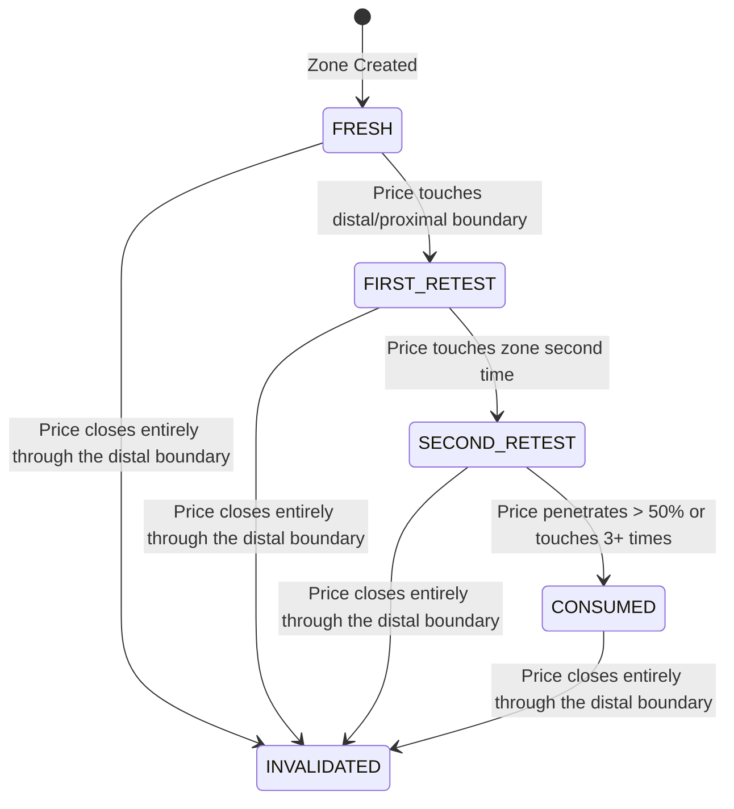

# Zone Scoring and Quality Model

This document outlines the scoring criteria, freshness state transitions, and evaluation weights used to rate supply and demand zones.

---

## 1. Scoring Weights

Each zone starts with a score out of 100, calculated using the following default configuration:

| Component | Weight | Description |
| :--- | :--- | :--- |
| **Base Quality** | 15 | Tightness, low body overlap, and small candle count (1–3 candles preferred) |
| **Departure** | 15 | Leg-out size (Range/ATR), body ratio, follow-through, and displacement |
| **Freshness** | 15 | Touch count (Fresh zones score highest; retests reduce points) |
| **Authentication** | 15 | Confluence with BOS/CHoCH, clean base structure, and context alignment |
| **Participation Proxy** | 10 | Measures momentum, volume expansion, and rejection spikes |
| **Structure** | 10 | Alignment with the current market structure bias (Bullish/Bearish) |
| **Trend Alignment** | 8 | Confluence with higher timeframe trend |
| **MA/VWAP Context** | 5 | Price relative to key EMAs (20, 50, 200) and VWAP |
| **Risk/Reward** | 7 | Mathematical expectancy (R:R $\ge 1:2$) |
| **Total** | **100** | |

### Rating Classifications
- **90–100**: A+ Setup
- **80–89**: Strong Setup
- **70–79**: Watchlist Zone
- **< 70**: Rejected Zone

> [!IMPORTANT]
> **Hard Rejection Override**: If a zone triggers any hard-rejection criteria (e.g., base count $> 6$, R:R $< 1:2$, or target overlaps with a strong opposing HTF zone), it is immediately marked as **Rejected** regardless of its nominal weighted score.

---

## 2. Zone Freshness States

A zone's state changes based on historical interactions:

### Touch Rules
- **Retest Touch**: Price enters the zone's boundaries (between proximal and distal lines) and exits. Merely approaching the boundary does not constitute a retest.
- **Invalidation**: A body close beyond the distal boundary immediately invalidates the zone.

---

## 3. Participation Proxy Score (`participation_proxy`)

The `ParticipationProxyScore` acts as a proxy for liquidity entry. It **MUST NOT** claim presence of verified "pending orders" (which cannot be proven from OHLCV). Instead, it metrics price speed and momentum using:

1. **Range/ATR Ratio**: Size of the leg-out relative to the 14-period average true range.
2. **Relative Volume (RVol)**: Volume of leg-out divided by 20-period simple moving average of volume.
3. **Body Percentage**: Close-to-open distance divided by total high-to-low range (identifies strong directional momentum).
4. **Displacement**: Total price distance covered during the leg-out phase within 1–3 candles.
5. **Follow-Through**: Continued movement in the direction of departure in subsequent candles.
